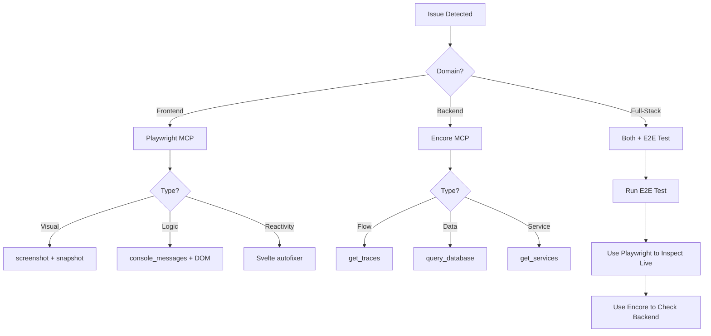

# Debugging Toolkit: ScreenGraph Best Practices

**Purpose**: Comprehensive reference for debugging techniques used in ScreenGraph development, documenting what works, what doesn't, and when to use each approach.

---

## 🎯 Debugging Philosophy

**Golden Rule**: Start with the highest-level tool available, drill down only when needed.

**Priority Order**:
1. **MCP Tools** (fastest, most contextual)
2. **Structured Logs** (for runtime behavior)
3. **Browser Inspection** (for frontend issues)
4. **Database Queries** (for data verification)
5. **Manual Testing** (for user experience)

---

## 🔧 Tool Arsenal

### **Frontend Debugging**

#### ✅ **What Works**

| Tool | When to Use | Example | Why It Works |
|------|------------|---------|--------------|
| **Playwright MCP** | UI state inspection, visual bugs, interaction testing | `playwright.snapshot()` → inspect DOM structure | Live browser access, no need for manual navigation |
| **Browser DevTools via MCP** | Console errors, network requests, timing issues | `playwright.console_messages()` → see all console logs | Captures runtime state without switching contexts |
| **Svelte Autofixer MCP** | Syntax validation, rune usage errors | `svelte.autofixer()` → validate before delivery | Catches Svelte 5 migration issues early |
| **Strategic `console.log`** | Tracking state changes, debugging reactivity | Add temporary logs, remove after fix | Simple, immediate feedback |
| **Type-Driven Development** | Preventing type mismatches | Let TypeScript catch issues at compile time | Catches bugs before runtime |

**Success Story**: Duplicate screenshot bug (FR-001)
- Used `playwright.snapshot()` to inspect live page
- Identified two nodes with same `#16` sequence
- Traced back to `screenId` mismatch between backend and graph projector
- Fixed by aligning `screenId` to use perceptual hash consistently

#### ❌ **What Didn't Work**

| Approach | Why It Failed | Better Alternative |
|----------|---------------|-------------------|
| Reading compiled Svelte JS | Too complex, loses structure | Use `svelte.get-documentation()` for patterns |
| Manual browser testing only | Time-consuming, not repeatable | Use Playwright MCP for automation |
| Adding debug UI overlays | Clutters production code | Use browser console via MCP |
| `alert()` for debugging | Blocks execution, poor UX | Use state-based error handling |

---

### **Backend Debugging**

#### ✅ **What Works**

| Tool | When to Use | Example | Why It Works |
|------|------------|---------|--------------|
| **Encore MCP** | Service introspection, trace analysis, live queries | `encore.get_traces()` → find request flow | Direct access to Encore runtime, no dashboard needed |
| **Structured Logging** | Runtime behavior, state transitions | `logger.info("state", { from, to })` | Searchable, filterable, timestamped |
| **Strategic Diagnostic Logs** | Pinpointing hang locations | Add `console.log("checkpoint 1")` temporarily | Quickly identifies where execution stops |
| **Database Queries via MCP** | Data verification, constraint issues | `encore.query_database()` → inspect tables | Direct SQL access without leaving IDE |
| **`encore test` + Logs** | Isolated testing with full runtime | Run tests, inspect structured logs | Tests run in real Encore environment |
| **Type-Driven Development** | API contract validation | Define types first, implement second | Catches mismatches at compile time |

**Success Story**: EnsureDevice hang (FR-001)
1. Manual test showed `agent.node.started #2` as last event
2. Added diagnostic logs to `node.ts` and `handler.ts`
3. Logs revealed events were created but not persisted
4. Added try-catch in `recordNodeEvents()` to catch silent errors
5. Found database CHECK constraint violation (missing event kinds in migration)
6. Created migration 010 to add new event kinds
7. **Result**: Hang fixed, all events now persist correctly

#### ❌ **What Didn't Work**

| Approach | Why It Failed | Better Alternative |
|----------|---------------|-------------------|
| Encore Dashboard only | UI was down/unavailable | Use Encore MCP tools instead |
| Direct PostgreSQL connection | Connection refused, complexity | Use `encore.query_database()` MCP |
| Mocking in unit tests for integration behavior | Tests passed but real system failed | Use `encore test` with real services |
| Reading raw `encore.gen` output | Too verbose, low signal | Use Encore MCP for metadata queries |
| Guessing at schema issues | Wasted time on wrong assumptions | Query actual schema via MCP |

**Anti-Pattern**: Running `encore run` to debug tests
- **Problem**: Tests should run in isolated `encore test` environment
- **Symptom**: "MCP error -32603: failed to find app"
- **Fix**: Import all service dependencies in test files, use `encore test`

---

### **Full-Stack Debugging**

#### ✅ **What Works**

| Tool | When to Use | Example | Why It Works |
|------|------------|---------|--------------|
| **E2E Tests + Browser Inspection** | User flow issues, integration bugs | Run E2E test, use Playwright MCP to inspect | Catches real-world interaction bugs |
| **Event Stream Analysis** | Tracing data flow backend → frontend | Check run_events table + frontend SSE | See full event lifecycle |
| **Comparative Testing** | "It works here but not there" | Test on same device/environment | Eliminates environmental variables |
| **Git Bisect** | Finding when a bug was introduced | `git bisect` with automated test | Quickly narrows down culprit commit |

**Success Story**: Graph projection mismatch (FR-001)
1. E2E test passed but duplicate screenshots visible
2. Used Playwright MCP to inspect live page during run
3. Found two nodes: one with `refId`, one with `screenId`
4. Traced to backend using `refId` in `screen_perceived` event
5. Fixed by aligning backend to use perceptual hash as `screenId`
6. Frontend now correctly handles synthetic → real node transition

#### ❌ **What Didn't Work**

| Approach | Why It Failed | Better Alternative |
|----------|---------------|-------------------|
| Debugging only backend OR frontend | Missed integration issues | Test full flow with E2E + MCP |
| Relying solely on unit tests | Didn't catch database constraint violations | Add integration tests with real DB |
| Skipping smoke tests | Regressions went unnoticed | Run `task qa:smoke:all` before push |

---

## 📋 Debugging Workflows

### **Frontend Issue Workflow**

```
1. Reproduce in browser
   └─ Use Playwright MCP if needed: playwright.navigate()

2. Inspect live state
   ├─ playwright.snapshot() → get DOM structure
   ├─ playwright.console_messages() → check for errors
   └─ playwright.screenshot() → visual verification

3. Locate source of issue
   ├─ Check component reactivity (Svelte runes)
   ├─ Verify API client calls (Encore-generated)
   └─ Use svelte.autofixer() for syntax issues

4. Implement fix
   └─ Add test case to prevent regression

5. Verify fix
   ├─ Re-run Playwright inspection
   └─ Run E2E test suite
```

### **Backend Issue Workflow**

```
1. Reproduce with test
   └─ Use `encore test` for isolated reproduction

2. Inspect runtime behavior
   ├─ Add strategic diagnostic logs
   ├─ encore.get_traces() → find request flow
   └─ encore.query_database() → verify data state

3. Locate source of issue
   ├─ Check event persistence (run_events table)
   ├─ Verify service metadata (encore.get_services())
   └─ Use sequential-thinking MCP for complex analysis

4. Implement fix
   ├─ Update code
   └─ Add database migration if needed

5. Verify fix
   ├─ Re-run test with diagnostic logs
   ├─ Run integration tests
   └─ Run smoke tests
```

### **"The Hang" Workflow**

When a process hangs with no clear error:

```
1. Add checkpoint logs
   console.log("🔍 CHECKPOINT 1: before X")
   console.log("🔍 CHECKPOINT 2: after X")

2. Run again, find last checkpoint
   └─ Hang is between last checkpoint and next

3. Add more granular checkpoints in that section
   └─ Narrow down to exact line

4. Inspect state at hang point
   ├─ Log all variables
   ├─ Check database state
   └─ Verify external dependencies (Appium, device)

5. Common hang causes:
   ├─ Uncaught async error (add try-catch)
   ├─ Database constraint violation (check logs)
   ├─ Deadlock (check transaction order)
   └─ External service timeout (add timeout handling)
```

---

## 🎓 Lessons Learned (FR-001)

### **Event Name Mismatch**

**Problem**: Code emitted `agent.appium.starting`, DB constraint allowed `agent.appium.start_initiated`

**Detection Method**: 
- `encore test` caught database constraint violation
- Diagnostic logs showed: `"new row violates check constraint"`

**Fix**: Aligned event names between code and migration

**Prevention**: Add validation script to compare `EventKind` types against DB constraints

### **DeviceId Filtering Bug**

**Problem**: Always returned `lines[0]`, even when specific `deviceId` requested

**Detection Method**:
- Code review post-implementation
- No automated test caught this initially

**Fix**: Added conditional logic to filter by `deviceId` when provided

**Prevention**: Add multi-device test scenarios in Phase 1 (foundational), not Phase 5 (polish)

### **Screenshot Duplication**

**Problem**: Frontend showed duplicate screenshots for same event

**Detection Method**:
1. E2E test passed (only checked for "at least 1 screenshot")
2. Manual testing via Playwright MCP revealed duplication
3. Inspected DOM: two nodes with same `#16` sequence

**Root Cause**:
- Backend `screen_perceived` event used artifact `refId` as `screenId`
- Graph projector used different deterministic `screenId` (appPackage + layoutHash)
- Frontend created synthetic node with `refId`, then received real node from graph stream

**Fix**:
- Backend: Use perceptual hash as `screenId` in `screen_perceived` event
- Frontend: Delete synthetic node when real node arrives

**Prevention**: 
- E2E test should assert exact count, not just "at least 1"
- Add visual regression testing for UI elements

### **Repository Rule False Positive**

**Problem**: GitHub blocked push saying "branch contains merge commits" even with clean linear history

**Root Cause**:
- Repository rule checked **entire branch history**, not just new commits
- Main branch contained merge commit from previous PR
- Feature branch inherited this commit, triggering false positive

**Detection Method**:
- Git log showed clean linear history locally
- Push error referenced old merge commit from main

**Fix**:
1. Adjusted GitHub rule to only apply to `main` branch
2. Updated Husky pre-push hook to check only new commits

**Prevention**: Document repository rule configuration in retro

---

## 🚀 Recommended Debugging Additions

### **For Future Specs**

1. **Phase 1 Validation Tasks**:
   - [ ] Validate event names against DB constraints
   - [ ] Test multi-device/multi-environment scenarios
   - [ ] Check migration sequence numbers

2. **Enhanced E2E Assertions**:
   - [ ] Assert exact counts, not "at least"
   - [ ] Add visual regression tests
   - [ ] Verify no duplicate elements

3. **Linter Rules**:
   - [ ] Enforce event name consistency (types ↔ migrations)
   - [ ] Flag hardcoded indexes (e.g., `lines[0]` without validation)
   - [ ] Require error handling for all async operations

4. **MCP Tool Usage**:
   - [ ] Always try MCP tools before manual dashboard/browser navigation
   - [ ] Document MCP tool results in commit messages
   - [ ] Use Encore MCP for test debugging instead of `encore run`

---

## 📚 Tool Reference

### **MCP Tools by Domain**

| Domain | Tools Available | Primary Use |
|--------|----------------|-------------|
| **Base** | graphiti, context7, sequential-thinking | Knowledge capture, docs, reasoning |
| **Backend** | encore-mcp, github | Service introspection, trace analysis |
| **Frontend** | playwright, svelte, figma, vercel | Browser automation, docs, deployment |
| **QA** | playwright, encore-mcp | E2E testing, integration debugging |
| **Infra** | github, vercel, mcp-builder | CI/CD, deployment, tool creation |

### **When to Use Each Tool**



---

## ✅ Quick Reference

### **Before Starting Debug Session**

- [ ] Load appropriate vibe (`backend_vibe`, `frontend_vibe`, `qa_vibe`)
- [ ] Search Graphiti for similar issues resolved previously
- [ ] Check `.claude-skills` for relevant debugging playbooks
- [ ] Ensure dev servers running (`task founder:servers:status`)

### **During Debugging**

- [ ] Start with MCP tools (highest level)
- [ ] Add strategic diagnostic logs (remove after)
- [ ] Document findings in comments as you go
- [ ] Use sequential-thinking MCP for complex reasoning

### **After Fixing**

- [ ] Remove diagnostic logs/console statements
- [ ] Add regression test
- [ ] Document solution in Graphiti
- [ ] Update retro.md with lessons learned
- [ ] Run full QA suite (`task qa:all`)

---

**Last Updated**: 2025-11-13  
**Related**: `vibes/README.md`, `.claude-skills/*/SKILL.md`, `CLAUDE.md`

